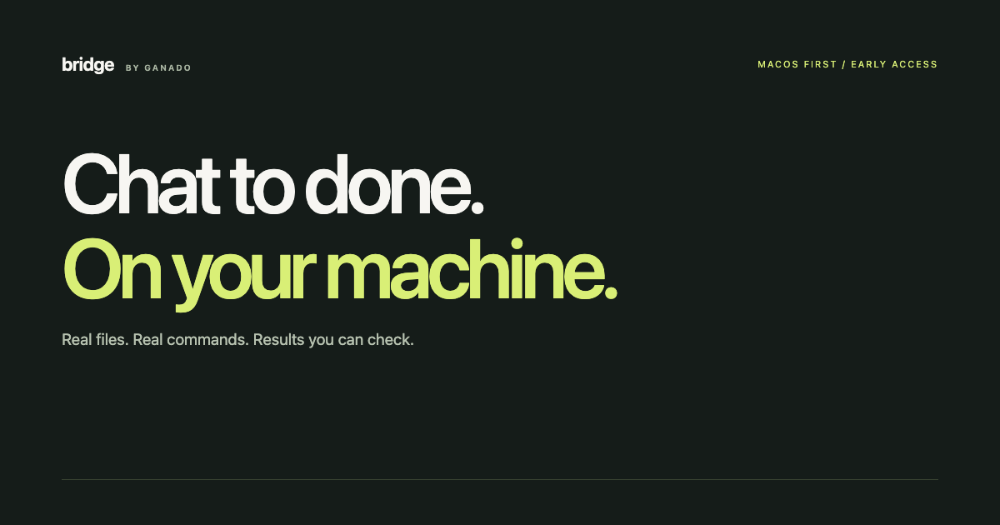

# Ganado Bridge

**Chat to done. On your machine.**

A working connection between your AI workflow and your own computer: real files, checked edits, command sessions and results you can inspect. macOS first.

[Try the local preview](https://ganado-bridge.vercel.app/install?utm_source=github) · [Documentation](https://ganado-bridge.vercel.app/docs) · [Security](https://ganado-bridge.vercel.app/security) · [Release status](https://ganado-bridge.vercel.app/changelog)

Local package metadata is now [active in the MCP Registry](https://registry.modelcontextprotocol.io/v0.1/servers/io.github.cynarax%2Fbridge-by-ganado/versions/0.1.0-preview.2). This is separate from the ChatGPT and desktop-extension directories; neither marketplace approval is claimed.

## Why we are building it

Copying terminal output between a computer and an AI assistant is not the interesting part of a task. Bridge gives the assistant tools to read the current file, compare its hash before changing it, run a command once and inspect its actual exit code.

## What exists today

- A public product website and free early-access list.
- A downloadable free local evaluation bundle: 13 MCP tools, bundled dependencies, checked file operations, process polling, built-in bounded search and explicit opt-in local access.
- 22 local agent tests plus real distributed-archive MCP acceptance on separate macOS and Ubuntu runners. The tests do not certify every desktop-client UI or represent a customer activation.

This repository is the **public documentation, release and feedback hub**. The maintained product source remains private. Download the exact [0.1.0-preview.2 bundle](https://github.com/cynarax/bridge-by-ganado/releases/tag/v0.1.0-preview.2), verify its [SHA-256](SHA256SUMS), and read [INSTALL.md](INSTALL.md) and [EVALUATION.md](EVALUATION.md) before enabling access. No signup or payment is required for the local evaluation.

## What is not shipping yet

A managed hosted customer connection, paid plan and public ChatGPT directory listing. The local evaluation is a separate delivery path. €19/month is a target price, not an active offer. No payment is taken when joining the list. Windows and Linux are interest-list options, not supported release claims.

## Practical guides

New: [Cursor local MCP setup on Mac](https://ganado-bridge.vercel.app/guides/cursor-local-files-mcp-mac?utm_source=github), [disconnected-server troubleshooting](https://ganado-bridge.vercel.app/guides/mcp-server-disconnected-macos?utm_source=github), and [local vs remote MCP](https://ganado-bridge.vercel.app/guides/local-vs-remote-mcp?utm_source=github). See [GUIDES.md](GUIDES.md) for the specific problem each guide addresses.

The proposed **EUR 29 one-time local commercial licence** is separate from the future managed subscription. It grants commercial-use rights to the same local tools; it does not add a remote relay. Check [current purchase availability and licence terms](https://ganado-bridge.vercel.app/licence?utm_source=github) before assuming sales are open. The free evaluation remains available without signup.

## A useful task has evidence

| Step | What should happen |
|---|---|
| Read | Inspect the current file, not a remembered snippet. |
| Change | Reject a stale hash or an ambiguous replacement. |
| Execute | Start a command once and poll the returned session. |
| Verify | Return actual output, exit status and any limitations. |

[Checked AI file edits](https://ganado-bridge.vercel.app/guides/checked-ai-file-edits?utm_source=github) · [Verifying AI terminal work](https://ganado-bridge.vercel.app/guides/verify-ai-terminal-work?utm_source=github)

## Understand the boundary

Bridge runs with the operating-system user's existing access. It is **not a sandbox**; commands can modify or delete data. Requested file contents and command output can be sent to your AI provider through the configured transport. The machine must be awake and connected; process sessions do not survive an agent restart.

The public website has no connection to the founder's computer or your computer. The private owner deployment is not offered as a shared customer endpoint.

## Feedback that helps

Open a workflow request describing the task you repeat, the step where your current AI setup fails and what a useful verified result would look like. After trying the bundle, optionally use the first-task report form; download counts and automated selftests are not counted as verified customer activations. Please do not include credentials, private documents or unredacted command logs. For a security concern, email info@ganado.cz instead of opening a public issue.

Built by Ganado International s.r.o., Czech Republic. Independent of OpenAI; no endorsement or directory approval claimed.
